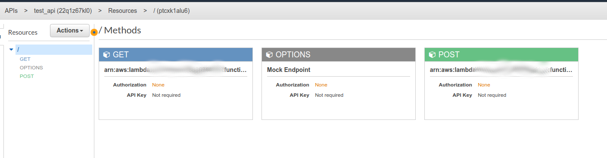

# serverless_webapp_demo
This is a proof of concept/demo of a serverless web app in AWS.  It doesn't do anything actually useful, but it does demonstrate using some of the services in AWS
to buid a web app without needing to spin up a web server.
## Lambda Functions
Create two Lambda functions, one called queue_writer and another called queue_reader.  The queue_writer.py and queue_reader.py files included in this repo contain
the needed code.  They're pretty small, but there is enough there for the demo.
## SQS Queue
You will need to create an SQS Queue called "example_application_queue".  A standard queue will work perfectly fine for the demo.  The file in the repo called
queue_policy.json has the permissions each of the roles associated with the Lambda functions you just created, but the ARNs contained in it are not correct for
your environment.  You will need to edit the file and place the correct ARNs in place.
## API Gateway
This is where things get interesting.  Instead of using a framework to write your code and then spinning up a web server to route traffic to and from it, AWS 
has an API gateway service to send data between your code and your users.  You will need to create an REST API gateway that has a single resource (/).  
Map GET to the queue_reader Lambda function and POST to queue_writer. Be sure to deploy your API after you have your routes in place.

# CORS
If you plan to use the API with a web application (as we have in this demo) you will need to enable CORS in your API.  It is very straight forward.
## Serverless Web Hosting
An S3 bucket can be configured to provide static web hosting.  Since all of our code either runs on the browser or in Lambda, this is all well and good.  Upload
index.html from the repo to a bucket you have created and enable web hosting.  Be sure to make the index file public.
